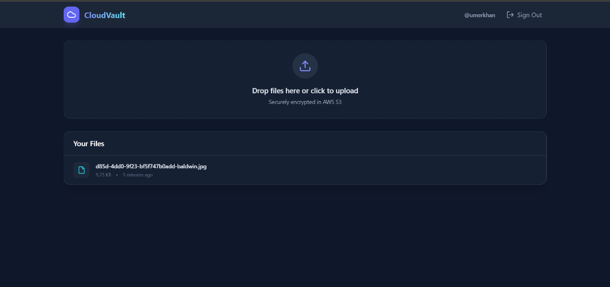
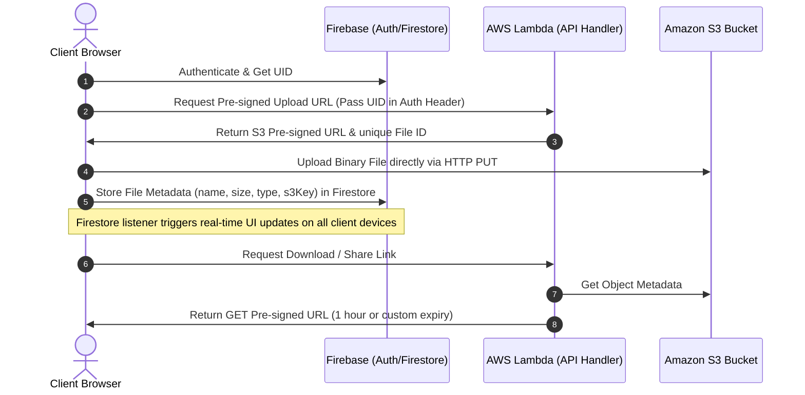

# ☁️ CloudVault — Secure Serverless File Sharing System

[](https://react.dev/)
[](https://vitejs.dev/)
[](https://aws.amazon.com/)
[](https://firebase.google.com/)
[](https://www.serverless.com/)
[](https://tailwindcss.com/)

CloudVault is a modern, secure, and real-time cloud file sharing system built on a serverless architecture using **AWS Lambda, Amazon S3, Firebase Firestore**, and a polished **React + Vite** frontend styled with **Tailwind CSS**. 

By utilizing **AWS S3 pre-signed URLs**, files are uploaded directly from the client browser to S3, bypassing Lambda payload size limitations and keeping backend execution lightweight, fast, and cost-effective. Users can securely upload, download, share, and delete their files, with changes synchronizing instantly across all active client sessions via Firebase Firestore real-time listeners.

---

## 📷 Screenshot



---

## ✨ Features

- **⚡ Real-Time Synchronization**: Instantly updates the file list across all open browser sessions and devices using Firebase Firestore `onSnapshot` subscriptions.
- **🔒 Direct-to-S3 Uploads**: Generates short-lived S3 pre-signed upload URLs from AWS Lambda, allowing files to be securely uploaded straight from the browser to S3.
- **🛡️ Secure File Isolation**: Each user's uploads are sandboxed inside isolated directories (`userId/*`) on S3 and scoped collections in Firestore.
- **⏳ Temporary File Sharing**: Generates secure pre-signed download URLs with configurable expiration times (up to 7 days / 168 hours) for sharing files externally.
- **🔑 Firebase Authentication**: Built-in authentication (login, signup, session persistence) to secure the application.
- **🔐 Enterprise-Grade Storage**: A completely private S3 bucket with public access blocked and server-side encryption (AES256) enabled by default.
- **🎨 Glassmorphic Interface**: A stunning, premium dark mode user interface built with Tailwind CSS, React, and Lucide React icons.

---

## 🏗️ Architecture

The system utilizes a serverless design that ensures cost efficiency and automatic scaling:



---

## 🛠️ Tech Stack

### Frontend
- **Framework**: React (v19) + Vite
- **Styling**: Tailwind CSS (v3)
- **Icons**: Lucide React
- **Authentication**: Firebase Authentication
- **Database (Metadata)**: Cloud Firestore (for real-time synchronization)

### Backend & Cloud Infrastructure
- **Serverless Engine**: Serverless Framework (v4)
- **FaaS**: AWS Lambda (Node.js 20.x runtime)
- **Storage**: Amazon S3 (Simple Storage Service)
- **SDK**: AWS SDK for JavaScript v3

---

## ⚙️ Configuration & Deployment

### 1. Prerequisites
- **Node.js** (v20.x or later)
- An **AWS Account** with configured IAM credentials (`LabRole` or standard CLI credentials)
- A **Firebase Project** with Firestore and Authentication (Email/Password) enabled
- **Serverless CLI** installed globally:
  ```bash
  npm install -g serverless
  ```

### 2. Backend Deployment (AWS Lambda + S3)
1. Navigate to the backend directory:
   ```bash
   cd backend
   ```
2. Install dependencies:
   ```bash
   npm install
   ```
3. Deploy the service to AWS:
   ```bash
   serverless deploy
   ```
4. Once deployed, note down the **Endpoint URL** (Lambda Function URL) returned in the console. It will look like:
   `https://<id>.lambda-url.us-east-1.on.aws`

### 3. Frontend Setup (React)
1. Navigate to the frontend directory:
   ```bash
   cd ../frontend
   ```
2. Install dependencies:
   ```bash
   npm install
   ```
3. Create a `.env` file by copying the template:
   ```bash
   cp .env.example .env
   ```
4. Fill in your Firebase API keys and the AWS Lambda Function URL:
   ```env
   VITE_API_ENDPOINT=https://your-lambda-url.lambda-url.us-east-1.on.aws
   VITE_FIREBASE_API_KEY=your-api-key
   VITE_FIREBASE_AUTH_DOMAIN=your-project.firebaseapp.com
   VITE_FIREBASE_PROJECT_ID=your-project-id
   VITE_FIREBASE_STORAGE_BUCKET=your-project.firebasestorage.app
   VITE_FIREBASE_MESSAGING_SENDER_ID=your-sender-id
   VITE_FIREBASE_APP_ID=your-app-id
   ```
5. Run the frontend development server:
   ```bash
   npm run dev
   ```
6. Build for production deployment:
   ```bash
   npm run build
   ```

---

## 🔌 API Endpoints Reference

All API calls must include the User ID (`UID`) in the `Authorization` header to authenticate the requester.

| Endpoint | Method | Headers | Query Params | Description |
| :--- | :--- | :--- | :--- | :--- |
| `/files/upload` | `GET` | `Authorization: <UID>` | `fileName`, `fileType`, `fileSize` | Generates a presigned S3 PUT URL for uploading. |
| `/files/{fileId}` | `GET` | `Authorization: <UID>` | — | Generates a presigned S3 GET URL (1-hour expiry). |
| `/files/{fileId}/share` | `GET` | `Authorization: <UID>` | `expiresInHours` (max: `168` hrs) | Generates a customizable sharing link. |
| `/files/{fileId}` | `DELETE` | `Authorization: <UID>` | — | Deletes the file object from S3. |

---

## 🔒 Security Configuration

### 1. Amazon S3 Bucket
- **Public Access**: Blocked (`BlockPublicAcls`, `BlockPublicPolicy`, `IgnorePublicAcls`, `RestrictPublicBuckets` set to `true`).
- **Encryption**: Default SSE encryption configured with the `AES256` algorithm.
- **CORS Configuration**: Restricts access to allowed methods (`GET`, `PUT`, `POST`, `DELETE`, `HEAD`) and headers.

### 2. Firestore Security Rules
To protect file metadata, Firestore rules must restrict read/write access to the authenticated resource owner:
```javascript
rules_version = '2';
service cloud.firestore {
  match /databases/{database}/documents {
    match /users/{userId}/files/{fileId} {
      allow read, write: if request.auth != null && request.auth.uid == userId;
    }
  }
}
```

---

## 📄 License
Distributed under the MIT License. See `LICENSE` for more details.
